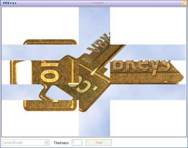



## Image Transitions

### Description

Up to 12 different image transitions in one UserControl!

Transition between 2 images Image A and Image B.
 
### More Info
 

             |
---                |---
**Submitted On**   |2005-06-01 17:50:50
**By**             |[VBKeys Team](https://github.com/Planet-Source-Code/PSCIndex/blob/master/ByAuthor/vbkeys-team.md)
**Level**          |Advanced
**User Rating**    |4.7 (33 globes from 7 users)
**Compatibility**  |VB 6\.0
**Category**       |[Graphics](https://github.com/Planet-Source-Code/PSCIndex/blob/master/ByCategory/graphics__1-46.md)
**World**          |[Visual Basic](https://github.com/Planet-Source-Code/PSCIndex/blob/master/ByWorld/visual-basic.md)
**Archive File**   |[Image\_Tran1924958182005\.zip](https://github.com/Planet-Source-Code/vbkeys-team-image-transitions__1-62225/archive/master.zip)

